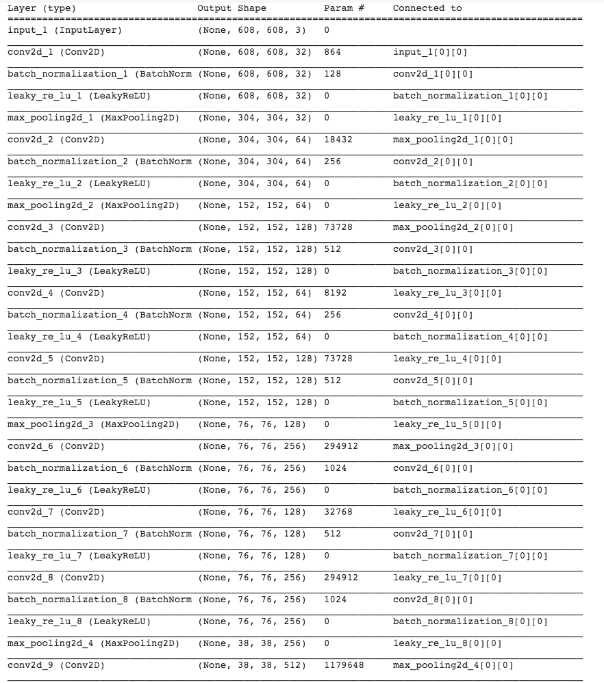
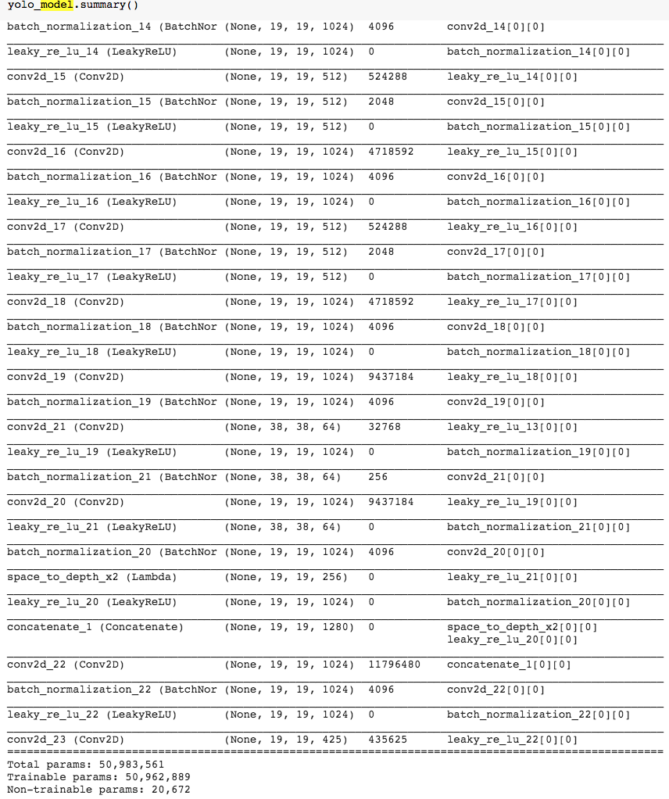

# Vehicle_Detection_YOLO
 
 This project is about object detection using the YOLO model. Many of the ideas in this notebook are described in the two YOLO papers: Redmon et al., 2016 (https://arxiv.org/abs/1506.02640) and Redmon and Farhadi, 2016 (https://arxiv.org/abs/1612.08242).

## Project Goal
The goal of this implementation is: 

1. Use object detection on a car detection dataset
2. Apply bounding boxes

## Project Background
A critical component of this project is to build a car detection system. To collect data, there is a mounted camera on the dashboard of the car, which takes pictures of the road ahead every few seconds while the user drive around.

Pictures taken from a car-mounted camera while driving around Silicon Valley.
Those data set is provided from [drive.ai](https://www.drive.ai/). Drive.ai is a company building the brains of self-driving vehicles.

All these images from this data set are stored into a folder and have labelled them by drawing bounding boxes around every car found. 


**Figure 1** : **Definition of a box**
If you have 80 classes that you want YOLO to recognize, you can represent the class label  𝑐  either as an integer from 1 to 80, or as an 80-dimensional vector (with 80 numbers) one component of which is 1 and the rest of which are 0. The video lectures had used the latter representation; in this notebook, we will use both representations, depending on which is more convenient for a particular step.

2016 YOLO algorithm in the paper before in the refence are applied for car detection. Since the YOLO model is very computationally expensive to train, we will load pre-trained weights in a h5 format.
YOLO ("you only look once") is a popular algoritm because it achieves high accuracy while also being able to run in real-time. This algorithm "only looks once" at the image in the sense that it requires only one forward propagation pass through the network to make predictions. After non-max suppression, it then outputs recognized objects together with the bounding boxes.

## Dataset details
The input is a batch of images of shape (m, 608, 608, 3)
The output is a list of bounding boxes along with the recognized classes. Each bounding box is represented by 6 numbers  (𝑝𝑐,𝑏𝑥,𝑏𝑦,𝑏ℎ,𝑏𝑤,𝑐). If you expand  𝑐  into an 80-dimensional vector, each bounding box is then represented by 85 numbers.
We will use 5 anchor boxes. So you can think of the YOLO architecture as the following: IMAGE (m, 608, 608, 3) -> DEEP CNN(Convolutional neural network) -> ENCODING (m, 19, 19, 5, 85).Since we are using 5 anchor boxes, each of the 19 x19 cells thus encodes information about 5 boxes. Anchor boxes are defined only by their width and height.
we are trying to detect 80 classes, and are using 5 anchor boxes. We have gathered the information about the 80 classes and 5 boxes in two files "coco_classes.txt" and "yolo_anchors.txt". Let's load these quantities into the model by running the next cell.
The car detection dataset has 720x1280 images, which we've pre-processed into 608x608 images.
```python
class_names = read_classes("model_data/coco_classes.txt")
anchors = read_anchors("model_data/yolo_anchors.txt")
image_shape = (720., 1280.)    
```
## Loading a pre-trained model
Training a YOLO model takes a very long time and requires a fairly large dataset of labelled bounding boxes for a large range of target classes. We load an existing pretrained Keras YOLO model stored in "yolo.h5". (These weights come from the official YOLO website, and were converted using a function written by Allan Zeleneer. For github policy, I didn't upload the model. Using pretrained model code looks like this:
```python
yolo_model = load_model("model_data/yolo.h5")
```
This loads the weights of a trained YOLO model. A summary of the layers this model contains are described in the `Model` section.


## Model 


Total params: 50,983,561
Trainable params: 50,962,889
Non-trainable params: 20,672

## Results

Found 7 boxes for test.jpg
|car |0.60 (925, 285) (1045, 374)|
|car |0.66 (706, 279) (786, 350)|
|bus |0.67 (5, 266) (220, 407)|
|car |0.70 (947, 324) (1280, 705)|
|car |0.74 (159, 303) (346, 440)|
|car |0.80 (761, 282) (942, 412)|
|car |0.89 (367, 300) (745, 648)|
## Reference 
1. [You Only Look Once](https://arxiv.org/abs/1506.02640) 
2. [Redmon and Farhadi, 2016](https://arxiv.org/abs/1612.08242).
3. Allan Zelener - [YAD2K: Yet Another Darknet 2 Keras](https://github.com/allanzelener/YAD2K)
4. [The official YOLO website](https://pjreddie.com/darknet/yolo/)
